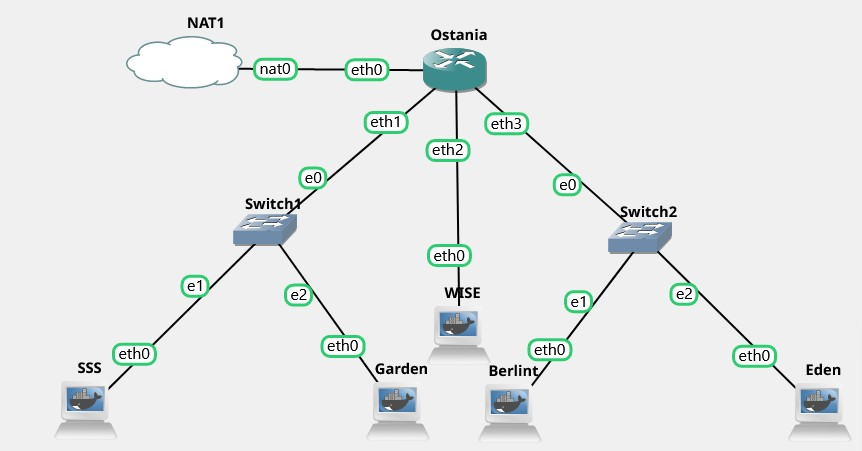

# Jarkom-Modul-2-A07-2022

## Anggota Kelompok

- I Putu Bagus Adhi Pradana (5025201010)
- Izzati Mukhammad (5025201075)
- Muhammad Damas Abhirama (5025201271)

## Nomor 1
WISE akan dijadikan sebagai DNS Master, Berlint akan dijadikan DNS Slave, dan Eden akan digunakan sebagai Web Server. Terdapat 2 Client yaitu SSS, dan Garden. Semua node terhubung pada router Ostania, sehingga dapat mengakses internet

Membuat Topologi Sebagai berikut

Konfigurasikan pada node `Ostania` sebagai berikut

    auto eth0
    iface eth0 inet dhcp

    auto eth1
    iface eth1 inet static
      address 192.172.1.1
      netmask 255.255.255.0

    auto eth2
    iface eth2 inet static
      address 192.172.2.1
      netmask 255.255.255.0

    auto eth3
    iface eth3 inet static
      address 192.172.3.1
      netmask 255.255.255.0
      
Lalu pada setiap node lakukan juga konfigurasi sebagai berikut

- WISE

      auto eth0
      iface eth0 inet static
        address 192.172.3.2
        netmask 255.255.255.0
        gateway 192.172.3.1
      
- SSS

      auto eth0
      iface eth0 inet static
        address 192.172.1.2
        netmask 255.255.255.0
        gateway 192.172.1.1
        
- Garden

      auto eth0
      iface eth0 inet static
        address 192.172.1.3
        netmask 255.255.255.0
        gateway 192.172.1.1
        
- Berlint

      auto eth0
      iface eth0 inet static
        address 192.172.2.2
        netmask 255.255.255.0
        gateway 192.172.2.1
        
- Eden

      auto eth0
      iface eth0 inet static
        address 192.172.2.3
        netmask 255.255.255.0
        gateway 192.172.2.1

## Nomor 2
Untuk mempermudah mendapatkan informasi mengenai misi dari Handler, bantulah Loid membuat website utama dengan akses `wise.A07.com` dengan alias `www.wise.A07.com` pada folder wise

    echo 'zone "wise.a07.com" {
        type master;
        file "/etc/bind/wise/wise.a07.com";
    };' > /etc/bind/named.conf.local
    mkdir /etc/bind/wise
    echo "
    \$TTL    604800
    @       IN      SOA     wise.a07.com. root.wise.a07.com. (
                                    2       ; Serial
                            604800          ; Refresh
                            86400           ; Retry
                            2419200         ; Expire
                            604800 )        ; Negative Cache TTL
    ;
    @               IN      NS      wise.a07.com.
    @               IN      A       192.172.2.2 ; IP Wise
    www             IN      CNAME   wise.a07.com.
    " > /etc/bind/wise/wise.a07.com
    service bind9 restart

## Nomor 3
Setelah itu ia juga ingin membuat subdomain eden.wise.A07.com dengan alias `www.eden.wise.A07.com` yang diatur DNS-nya di WISE dan mengarah ke Eden

Pada node `Wise` menambahkan `Eden` sebagai berikut

    echo "
    \$TTL    604800
    @       IN      SOA     wise.a07.com. root.wise.a07.com. (
                                    2       ; Serial
                            604800          ; Refresh
                            86400           ; Retry
                            2419200         ; Expire
                            604800 )        ; Negative Cache TTL
    ;
    @               IN      NS      wise.a07.com.
    @               IN      A       192.172.2.2 ; IP Wise
    www             IN      CNAME   wise.a07.com.
    eden           IN      A       192.172.3.3 ; IP Eden
    www.eden       IN      CNAME   eden.wise.a07.com.
    " > /etc/bind/wise/wise.a07.com
    service bind9 restart

Kemudian menjalankan `ping eden.wise.A07.com` dan `ping www.eden.wise.yyy.com`

## Nomor 4
Buat juga reverse domain untuk domain utama

Pada `Wise` bashrc

    echo '
    zone "wise.a07.com" {
            type master;
            file "/etc/bind/wise/wise.a07.com";
    };

    zone "2.172.192.in-addr.arpa" {
            type master;
            file "/etc/bind/wise/2.172.192.in-addr.arpa";
    };' > /etc/bind/named.conf.local

    echo "
    \$TTL    604800
    @       IN      SOA     wise.a07.com. root.wise.a07.com. (
                                    2       ; Serial
                            604800          ; Refresh
                            86400           ; Retry
                            2419200         ; Expire
                            604800 )        ; Negative Cache TTL
    ;
    2.172.192.in-addr.arpa.   IN      NS      wise.a07.com.
    2                       IN      PTR     wise.a07.com.
    "> /etc/bind/wise/2.172.192.in-addr.arpa
    service bind9 restart

## Nomor 5
Agar dapat tetap dihubungi jika server WISE bermasalah, buatlah juga Berlint sebagai DNS Slave untuk domain utama

Pada `Wise`

    echo '
    zone "wise.a07.com" {
            type master;
            notify yes;
            also-notify {192.172.3.2;};  //Masukan IP Berlint tanpa tanda petik
            allow-transfer {192.172.3.2;}; // Masukan IP Berlint tanpa tanda petik
            file "/etc/bind/wise/wise.a07.com";
    };

    zone "2.172.192.in-addr.arpa" {
            type master;
            file "/etc/bind/wise/2.172.192.in-addr.arpa";
    };' > /etc/bind/named.conf.local
    service bind9 restart
    
Pada `Berlint`

    apt-get update
    apt-get install bind9 -y
    echo '
    zone "wise.a07.com" {
            type slave;
            masters { 192.172.2.2; }; // Masukan IP Wise tanpa tanda petik
            file "/var/lib/bind/wise.a07.com";
    };
    ' > /etc/bind/named.conf.local
    service bind9 restart
    
`SSS`

    echo "
    nameserver 192.172.2.2
    nameserver 192.172.3.2
    nameserver 192.172.3.3

    " > /etc/resolv.conf    
    
`Garden`

    echo "
    nameserver 192.172.2.2
    nameserver 192.172.3.2
    nameserver 192.172.3.3

    " > /etc/resolv.conf

## Nomor 6
Karena banyak informasi dari Handler, buatlah subdomain yang khusus untuk operation yaitu operation.wise.A07.com dengan alias `www.operation.wise.A07.com` yang didelegasikan dari WISE ke Berlint dengan IP menuju ke Eden dalam folder operation

## Nomor 7
Untuk informasi yang lebih spesifik mengenai Operation Strix, buatlah subdomain melalui Berlint dengan akses `strix.operation.wise.A07.com` dengan alias `www.strix.operation.wise.A07.com` yang mengarah ke Eden

    echo "
    \$TTL    604800
    @       IN      SOA     operation.wise.a07.com. root.operation.wise.a07.com. (
                                    2      ; Serial
                            604800         ; Refresh
                            86400         ; Retry
                            2419200         ; Expire
                            604800 )       ; Negative Cache TTL
    ;
    @               IN      NS      operation.wise.a07.com.
    @               IN      A       192.172.3.3       ;ip Eden
    www             IN      CNAME   operation.wise.a07.com.
    strix         IN      A       192.172.3.3       ;IP Eden
    www.strix     IN      CNAME   strix.operation.wise.a07.com.
    " > /etc/bind/operation/operation.wise.a07.com
    service bind9 restart

## Nomor 8
Setelah melakukan konfigurasi server, maka dilakukan konfigurasi Webserver. Pertama dengan webserver `www.wise.A07.com.` Pertama, Loid membutuhkan webserver dengan DocumentRoot pada `/var/www/wise.A07.com`

    apt-get install apache2 -y
    service apache2 start
    apt-get install php -y
    apt-get install libapache2-mod-php7.0 -y
    service apache2 
    apt-get install ca-certificates openssl -y
    apt-get install unzip -y
    apt-get install git -y
    git clone https://github.com/3BeBeBe/M2J.git
    unzip -o /root/M2J/\*.zip -d /root/M2J
    echo "
    <VirtualHost *:80>

            ServerAdmin webmaster@localhost
            DocumentRoot /var/www/wise.a07.com
            ServerName wise.a07.com
            ServerAlias www.wise.a07.com

            ErrorLog \${APACHE_LOG_DIR}/error.log
            CustomLog \${APACHE_LOG_DIR}/access.log combined
    </VirtualHost>
    " > /etc/apache2/sites-available/wise.a07.com.conf
    a2ensite wise.a07.com
    mkdir /var/www/wise.a07.com
    cp -r /root/M2J/wise/. /var/www/wise.a07.com
    service apache2 restart

## Nomor 9
Setelah itu, Loid juga membutuhkan agar url `www.wise.yyy.com/index.php/home` dapat menjadi menjadi `www.wise.yyy.com/home`

    a2enmod rewrite
    service apache2 restart
    echo "
    RewriteEngine On
    RewriteCond %{REQUEST_FILENAME} !-f
    RewriteCond %{REQUEST_FILENAME} !-d
    RewriteRule (.*) /index.php/\$1 [L]
    " >/var/www/wise.a07.com/.htaccess
    echo "
    <VirtualHost *:80>
            ServerAdmin webmaster@localhost
            DocumentRoot /var/www/wise.a07.com
            ServerName wise.a07.com
            ServerAlias www.wise.a07.com

            ErrorLog \${APACHE_LOG_DIR}/error.log
            CustomLog \${APACHE_LOG_DIR}/access.log combined

            <Directory /var/www/wise.a07.com>
                    Options +FollowSymLinks -Multiviews
                    AllowOverride All
            </Directory>
    </VirtualHost>
    " > /etc/apache2/sites-available/wise.a07.com.conf
    service apache2 restart

## Nomor 10
Setelah itu, pada subdomain `www.eden.wise.yyy.com`, Loid membutuhkan penyimpanan aset yang memiliki DocumentRoot pada `/var/www/eden.wise.yyy.com`

    echo "
    <VirtualHost *:80>

            ServerAdmin webmaster@localhost
            DocumentRoot /var/www/eden.wise.a07.com
            ServerName eden.wise.a07.com
            ServerAlias www.eden.wise.a07.com

            ErrorLog \${APACHE_LOG_DIR}/error.log
            CustomLog \${APACHE_LOG_DIR}/access.log combined

            <Directory /var/www/wise.a07.com>
                    Options +FollowSymLinks -Multiviews
                    AllowOverride All
            </Directory>
    </VirtualHost>
    " > /etc/apache2/sites-available/eden.wise.a07.com.conf
    a2ensite eden.wise.a07.com
    mkdir /var/www/eden.wise.a07.com
    cp -r /root/M2J/eden.wise/. /var/www/eden.wise.a07.com
    service apache2 restart
    echo "<?php echo 'yes nomor 10' ?>" > /var/www/eden.wise.a07.com/index.php

## Nomor 11
Akan tetapi, pada folder `/public`, Loid ingin hanya dapat melakukan directory listing saja

    echo "
    <VirtualHost *:80>

            ServerAdmin webmaster@localhost
            DocumentRoot /var/www/eden.wise.a07.com
            ServerName eden.wise.a07.com
            ServerAlias www.eden.wise.a07.com

            <Directory /var/www/eden.wise.a07.com/public>
                    Options +Indexes
            </Directory>

            ErrorLog \${APACHE_LOG_DIR}/error.log
            CustomLog \${APACHE_LOG_DIR}/access.log combined

            <Directory /var/www/wise.a07.com>
                    Options +FollowSymLinks -Multiviews
                    AllowOverride All
            </Directory>
    </VirtualHost>
    " > /etc/apache2/sites-available/eden.wise.a07.com.conf
    service apache2 restart

## Nomor 12
Tidak hanya itu, Loid juga ingin menyiapkan error file `404.html` pada folder `/error` untuk mengganti error kode pada apache

    echo "
    <VirtualHost *:80>
            ServerAdmin webmaster@localhost
            DocumentRoot /var/www/eden.wise.a07.com
            ServerName eden.wise.a07.com
            ServerAlias www.eden.wise.a07.com

            ErrorDocument 404 /error/404.html
            ErrorDocument 500 /error/404.html
            ErrorDocument 502 /error/404.html
            ErrorDocument 503 /error/404.html
            ErrorDocument 504 /error/404.html

            <Directory /var/www/eden.wise.a07.com/public>
                    Options +Indexes
            </Directory>

            ErrorLog \${APACHE_LOG_DIR}/error.log
            CustomLog \${APACHE_LOG_DIR}/access.log combined

            <Directory /var/www/wise.a07.com>
                    Options +FollowSymLinks -Multiviews
                    AllowOverride All
            </Directory>
    </VirtualHost>
    " > /etc/apache2/sites-available/eden.wise.a07.com.conf
    service apache2 restart

## Nomor 13
Loid juga meminta Franky untuk dibuatkan konfigurasi virtual host. Virtual host ini bertujuan untuk dapat mengakses file asset` www.eden.wise.A07.com/public/js` menjadi `www.eden.wise.A07.com/js`

    echo "
    <VirtualHost *:80>

            ServerAdmin webmaster@localhost
            DocumentRoot /var/www/eden.wise.a07.com
            ServerName eden.wise.a07.com
            ServerAlias www.eden.wise.a07.com

            ErrorDocument 404 /error/404.html
            ErrorDocument 500 /error/404.html
            ErrorDocument 502 /error/404.html
            ErrorDocument 503 /error/404.html
            ErrorDocument 504 /error/404.html

            <Directory /var/www/eden.wise.a07.com/public>
                    Options +Indexes
            </Directory>

            Alias \"/js\" \"/var/www/eden.wise.a07.com/public/js\"

            ErrorLog \${APACHE_LOG_DIR}/error.log
            CustomLog \${APACHE_LOG_DIR}/access.log combined

            <Directory /var/www/wise.a07.com>
                    Options +FollowSymLinks -Multiviews
                    AllowOverride All
            </Directory>
    </VirtualHost>
    " > /etc/apache2/sites-available/eden.wise.a07.com.conf
    service apache2 restart

## Nomor 14
Loid meminta agar `www.strix.operation.wise.A07.com` hanya bisa diakses dengan `port 15000` dan `port 15500 (14)` dengan autentikasi username Twilight dan password `opStrix dan file di /var/www/strix.operation.wise.A07`

    echo "
    <VirtualHost *:15000>

            ServerAdmin webmaster@localhost
            DocumentRoot /var/www/strix.operation.wise.a07.com
            ServerName strix.operation.wise.a07.com
            ServerAlias www.strix.operation.wise.a07.com

            ErrorLog \${APACHE_LOG_DIR}/error.log
            CustomLog \${APACHE_LOG_DIR}/access.log combined
    </VirtualHost>
    <VirtualHost *:15500>        
            ServerAdmin webmaster@localhost
            DocumentRoot /var/www/strix.operation.wise.a07.com
            ServerName strix.operation.wise.a07.com
            ServerAlias www.strix.operation.wise.a07.com

            ErrorLog \${APACHE_LOG_DIR}/error.log
            CustomLog \${APACHE_LOG_DIR}/access.log combined
    </VirtualHost>
    " > /etc/apache2/sites-available/strix.operation.wise.a07.com.conf
    a2ensite strix.operation.wise.a07.com
    service apache2 restart
    mkdir /var/www/strix.operation.wise.a07.com
    cp -r /root/M2J/strix.operation.wise/. /var/www/strix.operation.wise.a07.com/
    echo "
    <?php
            echo 'selamat 14';
    ?>
    " > /var/www/strix.operation.wise.a07.com/index.php
    echo "
    # If you just change the port or add more ports here, you will likely also
    # have to change the VirtualHost statement in
    # /etc/apache2/sites-enabled/000-default.conf

    Listen 80
    Listen 15000
    Listen 15500
    <IfModule ssl_module>
            Listen 443
    </IfModule>

    <IfModule mod_gnutls.c>
            Listen 443
    </IfModule>
    " > /etc/apache2/ports.conf

    service apache2 restart

## Nomor 15
dengan autentikasi username Twilight dan password opStrix dan file di `/var/www/strix.operation.wise.A07`
 
    htpasswd -c -b /etc/apache2/.htpasswd Twilight opStrix

    echo "
    <VirtualHost *:15000>

            ServerAdmin webmaster@localhost
            DocumentRoot /var/www/strix.operation.wise.a07.com
            ServerName strix.operation.wise.a07.com
            ServerAlias www.strix.operation.wise.a07.com

            <Directory \"/var/www/strix.operation.wise.a07.com\">
                    AuthType Basic
                    AuthName \"Restricted Content\"
                    AuthUserFile /etc/apache2/.htpasswd
                    Require valid-user
            </Directory>

            ErrorLog \${APACHE_LOG_DIR}/error.log
            CustomLog \${APACHE_LOG_DIR}/access.log combined
    </VirtualHost>
    <VirtualHost *:15500>        
            ServerAdmin webmaster@localhost
            DocumentRoot /var/www/strix.operation.wise.a07.com
            ServerName strix.operation.wise.a07.com
            ServerAlias www.strix.operation.wise.a07.com

            <Directory \"/var/www/strix.operation.wise.a07.com\">
                    AuthType Basic
                    AuthName \"Restricted Content\"
                    AuthUserFile /etc/apache2/.htpasswd
                    Require valid-user
            </Directory>

            ErrorLog \${APACHE_LOG_DIR}/error.log
            CustomLog \${APACHE_LOG_DIR}/access.log combined
    </VirtualHost>
    " > /etc/apache2/sites-available/strix.operation.wise.a07.com.conf
    service apache2 restart

## Nomor 16
dan setiap kali mengakses IP Eden akan dialihkan secara otomatis ke `www.wise.A07.com`

    echo "
    <VirtualHost *:80>

            ServerAdmin webmaster@localhost
            DocumentRoot /var/www/html

            RewriteEngine On
            RewriteCond %{HTTP_HOST} !^wise.a07.com$
            RewriteRule /.* http://wise.a07.com/ [R]

            ErrorLog \${APACHE_LOG_DIR}/error.log
            CustomLog \${APACHE_LOG_DIR}/access.log combined

    </VirtualHost>
    " > /etc/apache2/sites-available/000-default.conf
    service apache2 restart

## Nomor 17
Karena website `www.eden.wise.A07.com` semakin banyak pengunjung dan banyak modifikasi sehingga banyak gambar-gambar yang random, maka Loid ingin mengubah request gambar yang memiliki substring `“eden”` akan diarahkan menuju `eden.png.` Bantulah Agent Twilight dan Organisasi WISE menjaga perdamaian!

    echo "
    RewriteEngine On
    RewriteCond %{REQUEST_URI} ^/public/images/(.*)eden(.*)
    RewriteCond %{REQUEST_URI} !/public/images/eden.png
    RewriteRule /.* http://eden.wise.a07.com/public/images/eden.png [L]
    " > /var/www/eden.wise.a07.com/.htaccess

    echo "
    <VirtualHost *:80>

            ServerAdmin webmaster@localhost
            DocumentRoot /var/www/eden.wise.a07.com
            ServerName eden.wise.a07.com
            ServerAlias www.eden.wise.a07.com

            ErrorDocument 404 /error/404.html
            ErrorDocument 500 /error/404.html
            ErrorDocument 502 /error/404.html
            ErrorDocument 503 /error/404.html
            ErrorDocument 504 /error/404.html

            <Directory /var/www/eden.wise.a07.com/public>
                    Options +Indexes
            </Directory>

            Alias \"/js\" \"/var/www/eden.wise.a07.com/public/js\"

            <Directory /var/www/eden.wise.a07.com>
                    Options +FollowSymLinks -Multiviews
                    AllowOverride All
            </Directory>
            ErrorLog \${APACHE_LOG_DIR}/error.log
            CustomLog \${APACHE_LOG_DIR}/access.log combined

            <Directory /var/www/wise.a07.com>
                    Options +FollowSymLinks -Multiviews
                    AllowOverride All
            </Directory>
    </VirtualHost>
    " > /etc/apache2/sites-available/eden.wise.a07.com.conf
    service apache2 restart
